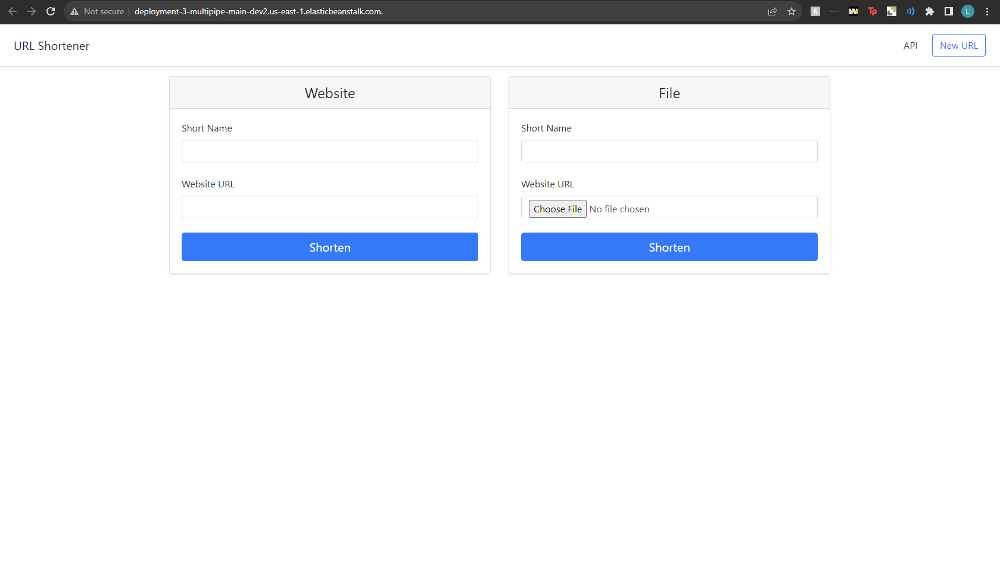

<p align="center">

</p>
<h1 align="center">C4_deployment-3<h1> 


# Purpose
- The Purpose of this project is to:
    - Create a Jenkins Server on EC2
    - Run a Build using Jenkins
    - Utilising Jenkins to create EB instance.
    - Upload the Application on Elastic Beanstalk with Jenkins.
    - Observe and Use the URL Shortener Web App.

# Issues
- Issue with groovy syntax when deploying the app from Jenkins.
- Issue with setting the right permisions while configuring AWS EB CLI.
  All issues resolved.
   
# Steps for creating a Jenkins Server on Amazon EC2 using Jenkins Debian Packages

Follow these steps to set up a Jenkins server on an Amazon EC2 instance using Jenkins Debian Packages:

1. **Sign in to your AWS Account:**
   - Logged in to [Amazon Web Services (AWS) Console](https://aws.amazon.com/)

2. **Launch an EC2 Instance:**
   - From the AWS Management Console, navigate to the EC2 Dashboard.
   - Click on "Launch Instances."
   - Named the Instance "Deployment 2 Jenkins Instance"
   - Chose Ubuntu.
   - Selected an instance type "t2.micro".
   - Configured instance details (key pair login), network settings, and storage.
   - Configured security groups to allow SSH (port 22) and HTTP (port 8080) access (ssh-access & Jenkins).

3. **Connect to the EC2 Instance:**
   - Once the instance is running, I connected to it using SSH.
   - On my local device, I copied my public ssh key and pasted it in the "authorized_keys" file on the EC2 instance
   - I used Windows PowerShell terminal.
   - Use the following command to connect:
     ```bash
     ssh ubuntu@your-instance-ip
     ```

4. **Install Python 3.10, python3.10-venv, python3-pip, and unzip:**
   - Update the package list:
     ```bash
     sudo apt update
     sudo apt install python3.10 python3.10-venv python3-pip unzip -y
     ```

5. **Install Java and Jenkins:**
   - Install Java and Jenkins using the Jenkins Debian Packages:
     ```bash
     # Add the Jenkins repository key to the system
     curl -fsSL https://pkg.jenkins.io/debian/jenkins.io-2023.key | sudo tee \
       /usr/share/keyrings/jenkins-keyring.asc > /dev/null
     # Add Jenkins apt repository entry
     echo deb [signed-by=/usr/share/keyrings/jenkins-keyring.asc] \
       https://pkg.jenkins.io/debian binary/ | sudo tee \
       /etc/apt/sources.list.d/jenkins.list > /dev/null
     # Update local package index
     sudo apt-get update
     # Install required packages
     sudo apt-get install fontconfig openjdk-17-jre
     # Install Jenkins
     sudo apt-get install jenkins
     ```
   
6. **Start Jenkins and Enable on Boot:**
   - Start the Jenkins service:
     ```bash
     sudo systemctl start jenkins
     ```
   - Enable Jenkins to start on boot:
     ```bash
     sudo systemctl enable jenkins
     ```

7. **Access Jenkins Web Interface:**
   - Open a web browser and navigate to `http://your-instance-ip:8080`.
   - Retrieve the initial admin password from the server:
     ```bash
     sudo cat /var/lib/jenkins/secrets/initialAdminPassword
     ```
   - Copy the password and paste it into the Jenkins Unlock page.

8. **Install Recommended Plugins:**
   - Choose the "Install suggested plugins" option during the setup wizard.

9. **Create an Admin User:**
   - Fill out the required information to create an admin user for Jenkins.

10. **Adding Plugins to Jenkins - Install "Pipeline Utility Steps" Plugin:**
    - In the Jenkins dashboard, click on "Manage Jenkins" in the left-hand menu.
    - From the drop-down menu, select "Manage Plugins."
    - In the "Filter" search bar, type "Pipeline Utility Steps" to find the plugin.
   - Locate the "Pipeline Utility Steps" plugin in the list of available plugins.
   - Click the "Install without restart" button at the bottom of the page. This will download and 
     install the selected plugin.

11. **Start Using Jenkins:**
    - Once the setup is complete, you can start using Jenkins to create jobs and pipelines for your projects.

## Jenkins Build Test and Download of zip.

Follow these steps to build the application onto Jenkins:

1. **Download and Extract Files:**  
   - Download the files from KuraLabs and unzip them.

2. **Repository Setup:**  
   - Create a new repository.
   - Paste the downloaded files into the repository.

3. **Jenkins Configuration:**  
   - Log in to the Jenkins instance created above.
   - Created a new build with the name "Deployment3EthanArteta".
   - Make sure multibranch pipeline is selected.

4. **Github Token Generation:**  
   - Generate a new token from GitHub for authentication.

5. **Jenkins Credentials:**  
   - Create new credentials in Jenkins to enable deployment of GitHub files.

6. **Pipeline Setup:**  
   - Apply and save the pipeline build configuration.

7. **Application Build:**  
   - Successfully ran the application build in Jenkins.

# How to Install AWS Command Line Interface (CLI)

## AWS Command Line Interface (CLI) Installation

Follow these steps to install the AWS Command Line Interface (CLI):

### 1. Create an IAM User and Access Key

1. Open the AWS Management Console.

2. In the search field, type "iam," and click on "IAM" when it appears.

3. In the IAM dashboard, under the "Users" section, click the number of users.

4. Click on your username.

5. In the user details page, click on "Security credentials."

6. Scroll down and click "Create access key."

7. Choose "Command Line Interface (CLI)" and click the checkbox to acknowledge.

8. Click "Next."

9. In the "Description tag value" field, type "AWS_CLI."

10. Click "Create access key."

11. Save the Access Key ID and Secret Access Key or download them as a .csv file. You'll need these credentials for configuration.

### 2. Install AWS CLI

12. Log in to the machine where you want to install the AWS CLI. You can use an instance with VS Code installed, or you can open a terminal on your local machine.

13. Run the following command to download the AWS CLI installation package:

    ```bash
    curl "https://awscli.amazonaws.com/awscli-exe-linux-x86_64.zip" -o "awscliv2.zip"
    ```

14. Unzip the downloaded package:

    ```bash
    unzip awscliv2.zip
    ```

15. Install the AWS CLI using the provided installation script:

    ```bash
    sudo ./aws/install
    ```

16. To verify that the AWS CLI is installed correctly, run the following command:

    ```bash
    aws --version
    ```

### 3. Configure AWS CLI

17. To configure the AWS CLI with your access credentials, run the following command:

    ```bash
    aws configure
    ```

18. Enter your Access Key ID when prompted.

19. Enter your Secret Access Key when prompted.

20. For the "Default region name," type your desired AWS region (e.g., us-east-1).

21. For the "Default output format," type "json."

### 4. Test Your AWS CLI Configuration

22. To test your AWS CLI credentials, run the following command:

    ```bash
    aws sts get-caller-identity
    ```

23. If the configuration is correct, you should see JSON output displaying your AWS account's caller identity information.


# Setting Up AWS Elastic Beanstalk Deployment for Jenkins

### Step-by-Step Instructions

#### 1. Create a Simple Password for Jenkins User

1. Create a simple password for the Jenkins user. This password will be needed to sign in as the Jenkins user later.

    ```bash
   sudo passwd jenkins
   ```

#### 2. Sign In as Jenkins User

2. Sign in as the Jenkins user using the following command:

   ```bash
   sudo su - jenkins -s /bin/bash
   ```

#### 3. Download EB CLI

3. Download the AWS Elastic Beanstalk Command Line Interface (EB CLI) by running the following command:

   ```bash
   pip install awsebcli --upgrade --user
   ```

#### 4. Update the PATH Environment Variable

4. Update the PATH environment variable to include the EB CLI binaries:

   ```bash
   export PATH=$PATH:$HOME/.local/bin
   ```

#### 5. Check EB CLI Installation

5. Verify that the EB CLI is installed correctly by running the following command:

   ```bash
   eb --version
   ```

#### 6. Create AWS Elastic Beanstalk Roles

6. Create the necessary AWS Identity and Access Management (IAM) roles for Elastic Beanstalk. Refer to the AWS documentation for guidance on setting up these roles.

#### 7. Configure AWS CLI Credentials

7. Configure the AWS Command Line Interface (CLI) credentials by running:

   ```bash
   aws configure
   ```

   Enter your Access Key ID, Secret Access Key, default region name (e.g., us-east-1), and output format (e.g., json) as prompted.

#### 8. Navigate to Workspace

8. Navigate to your Jenkins workspace directory where your project is located.

#### 9. Access Multibranch Pipeline

9. Within

 your workspace directory, you should see a list of multibranch pipelines. Use the `cd` command to navigate into the directory corresponding to your multibranch pipeline.

#### 10. Initialize EB CLI

10. Run the following command to initialize the EB CLI:

    ```bash
    eb init
    ```

    Follow the prompts and select the following options:
    - AWS region (e.g., us-east-1)
    - Python version (e.g., 3.9)
    - "n" for CodeCommit repository
    - "n" for SSH

#### 11. Create an Elastic Beanstalk Environment

11. Create an Elastic Beanstalk environment by running the following command:

    ```bash
    eb create
    ```

    Follow the prompts and press Enter as needed. When asked about "spot fleet," choose "n" (no).

#### 12. View Application URL

12. Once Elastic Beanstalk finishes creating the environment, you can find the application URL on the third-to-last line of the command output, under "Application available at URL."


# Setting up a GitHub Webhook for Jenkins Deployment


These steps will walk you through the process of setting up a GitHub webhook for Jenkins deployment. GitHub webhooks allow you to automate the deployment process in Jenkins whenever changes are pushed to your repository. Follow the steps below to configure the webhook.

## Step-by-Step Instructions

### 1. Access Repository Settings

1. Navigate to your GitHub repository's main page.
2. Click on the "Settings" tab located on the right-hand side of the repository menu.

### 2. Access Webhooks

3. In the "Settings" page, find and click on the "Webhooks" option from the left-hand menu.

### 3. Add Webhook

4. On the "Webhooks" page, locate and click the "Add webhook" button.

### 4. Configure Payload URL

5. In the "Add webhook" page, you will see a "Payload URL" field. Click on this field to configure it.

### 5. Save Webhook

6. After configuring the "Payload URL," scroll down and click the "Add webhook" button at the bottom of the page to save your changes.

### 6. Obtain the HTTP URL

7. Once the webhook is added, you will be directed to a page displaying webhook details. Find and click the "http" URL to copy it to your clipboard. You will need this URL to configure Jenkins.

### 7. Verify Recent Deliveries

8. In the webhook details page, click on "Recent Deliveries" from the left-hand menu. This section provides information about the recent deliveries made to your webhook.

### 8. Confirm Successful Configuration

9. To verify that the webhook is set up correctly, click on one of the recent deliveries. You should see a response code of "200," indicating that the webhook configuration is working as expected.


# Optimization 
- I would optimize this project by automating the setup of AWS IAM roles and permissions.


# Diagram and Images



